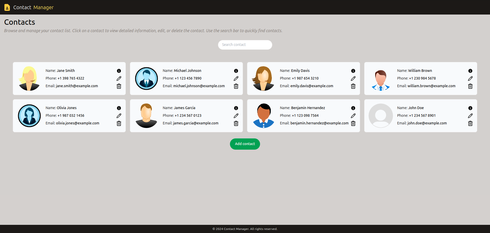
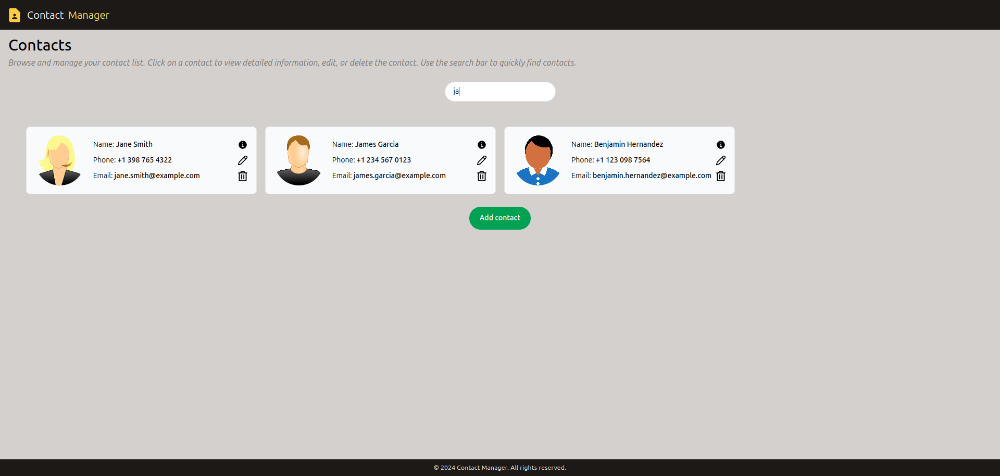
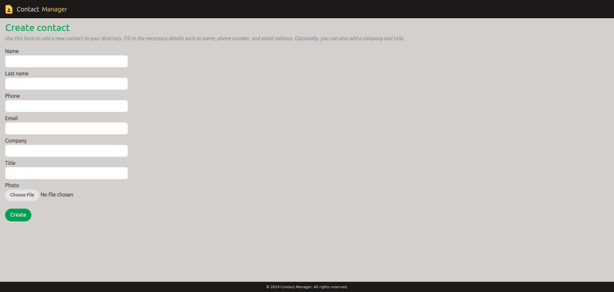
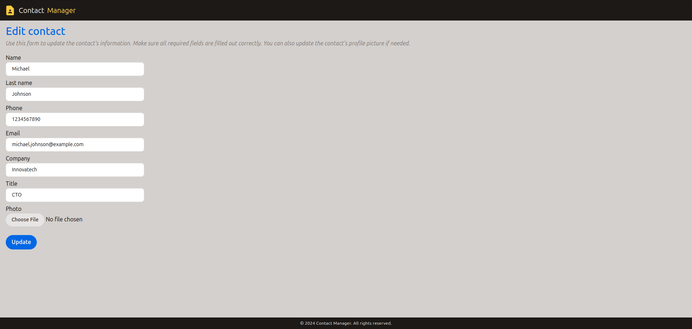
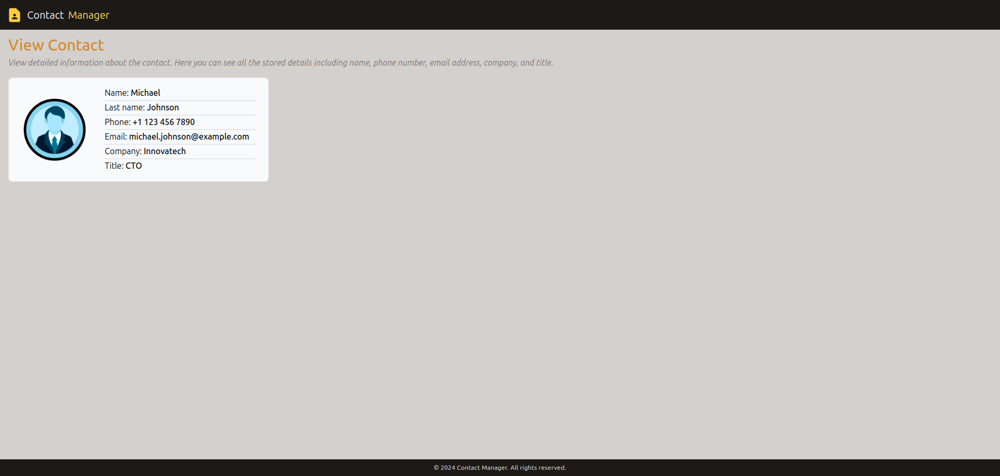
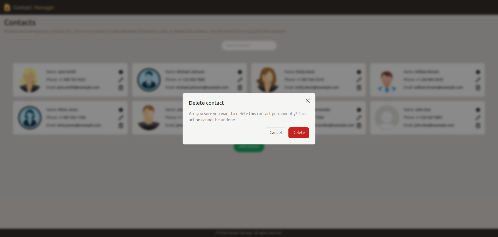

# Contact Manager

Contact Manager is a personal project designed to experiment with creating, reading, updating, and deleting (CRUD) operations for managing contacts. The project leverages modern web development technologies including React, Tailwind CSS, React Hot Toast, React Hook Form, Zod, React Query, and React Router.

## Features

- **Contact Management**

  - Create, update, delete, and view contacts with ease.
  - Access detailed information for each contact.

- **Search and Filter**

  - Quickly search and filter contacts to find specific information.

- **Notifications**

  - Receive real-time notifications for successful and erroneous actions.

- **Form Handling and Validation**

  - Robust form handling and validation to ensure accurate data entry.

- **Custom Modal**

  - Use custom modal windows for various interactions within the app.

- **Phone Number Formatting**

  - Automatically format phone numbers as users type.

- **Custom Hooks**
  - Utilize custom hooks for efficient contact management.

## Screenshots














## Installation

1. Clone the repository:

   ```bash
   git clone https://github.com/lucchesilorenzo/contact-manager.git
   cd contact-manager
   ```

2. Install dependencies:

   ```bash
   npm install
   ```

3. Start the development server:
   ```bash
   npm run dev
   ```
